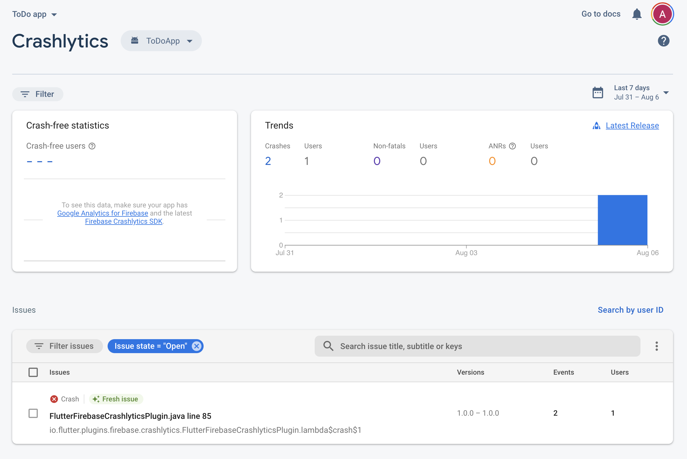
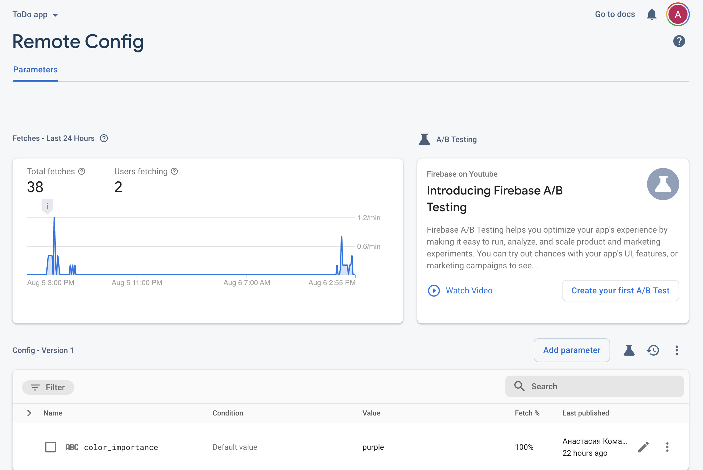

# todo_app

Done

##     

1) Создан экран со списком дел, есть возможность отмечать дела как сделанные, удалять ненужнеы дела
2) Создан экран для добавления задачи с дедлайном и возможностью проставить важность задачи

For generating models (for drift_dev)  
flutter packages pub run build_runner build

Crashlytics:

Remote Config:

android apk:
<app dir>build/app/outputs/flutter-apk/app-release.apk